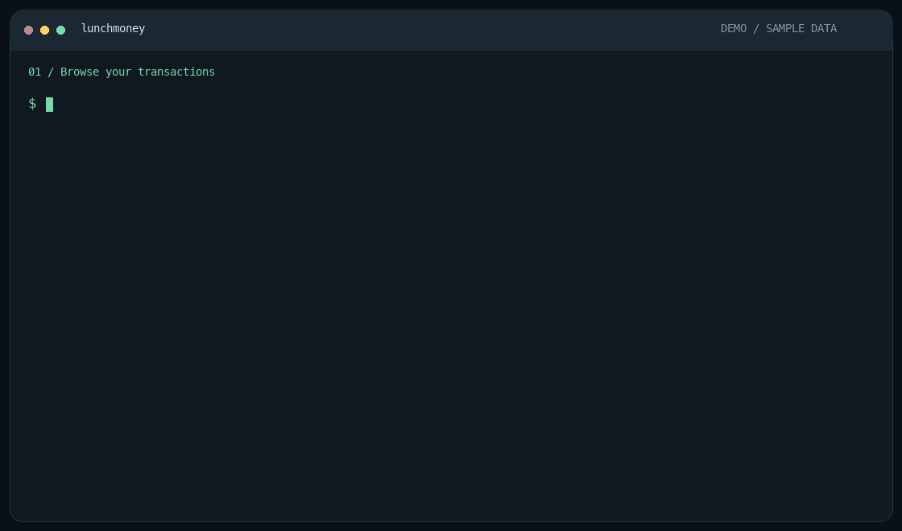

# lunchmoney

An agent-friendly CLI for [Lunch Money API v2](https://lunchmoney.dev). Interactive terminals get compact, resource-aware tables; pipes get stable JSON. Transaction tables resolve category and account IDs into names and automatically fit the terminal width.

Use it to browse and filter transactions, manage categories and accounts, track
monthly budgets, review AI suggestions one transaction at a time, or chat with an
assistant that can query your account and carry out requested actions.



*Recorded with sample data and mock AI responses. [Read the demo transcript](docs/demo-transcript.txt).*

## Contents

- [Install and authenticate](#install-and-authenticate)
- [Quick examples](#quick-examples)
- [Command reference](#command-reference)
- [Output and scripting](#output-and-scripting)
- [Transactions and filters](#transactions-and-filters)
- [Monthly budget view](#monthly-budget-view)
- [Summaries, accounts, and recurring items](#summaries-accounts-and-recurring-items)
- [JSON bodies and raw API requests](#json-bodies-and-raw-api-requests)
- [AI configuration](#ai-configuration)
- [Interactive transaction review](#interactive-transaction-review)
- [Account chat](#account-chat)
- [Transaction history research](#transaction-history-research)
- [Merchant web research](#merchant-web-research)
- [Jev](#jev)
- [Shell completion](#shell-completion)
- [Troubleshooting](#troubleshooting)

## Install and authenticate

Download a binary archive from [GitHub Releases](https://github.com/joehoyle/lunchmoney-cli/releases)
for your platform:

| Platform | Archive |
| --- | --- |
| macOS (Apple Silicon) | `lunchmoney-aarch64-apple-darwin.tar.gz` |
| macOS (Intel) | `lunchmoney-x86_64-apple-darwin.tar.gz` |
| Linux (x86_64, glibc 2.35+) | `lunchmoney-x86_64-unknown-linux-gnu.tar.gz` |
| Linux (ARM64, glibc 2.35+) | `lunchmoney-aarch64-unknown-linux-gnu.tar.gz` |

Extract the archive and put the `lunchmoney` executable on your `PATH`.
Each release includes `SHA256SUMS` to verify the downloaded archives.

Or install from this checkout with a Rust toolchain that supports edition 2024:

```sh
cargo install --path .
lunchmoney auth login
```

For downloaded binaries, run `lunchmoney auth login` after installation too.

`auth login` prompts with hidden input and saves your Lunch Money developer API
token for future shells. The saved token is a local JSON file. On Unix, the
directory has mode `0700` and the file has mode `0600`.

| Platform | Default token file |
| --- | --- |
| macOS | `~/Library/Application Support/lunchmoney/config.json` |
| Linux / other Unix | `~/.config/lunchmoney/config.json` |
| Windows | `%APPDATA%\lunchmoney\config.json` |

When set, `XDG_CONFIG_HOME` overrides the configuration directory on every platform;
the token is saved at `$XDG_CONFIG_HOME/lunchmoney/config.json`. AI settings and
research caches live in the same directory.

You can still set `LUNCH_MONEY_TOKEN` or pass `--token` for a single invocation. Those take precedence over the saved token. Run `lunchmoney auth status` to check configuration without exposing the token, or `lunchmoney auth logout` to remove it.

## Quick examples

```sh
lunchmoney me
lunchmoney transactions list
lunchmoney transactions list --month 2026-01
lunchmoney transactions list --category "Dining"
lunchmoney transactions list --category "Food" --month 2026-01
lunchmoney transactions list --wide
lunchmoney transactions list --exclude-pending
lunchmoney --output json categories list | jq '.categories[].name'
lunchmoney categories create --body '{"name":"Coffee","is_income":false}'
lunchmoney transactions create --body @transaction.json
lunchmoney budgets view
lunchmoney budgets view --month 2026-01
lunchmoney budgets delete --category-id 42 --start-date 2026-01-01
lunchmoney raw get /recurring_items
lunchmoney ai providers
lunchmoney ai chat --read-only
lunchmoney transactions review --month 2026-09
```

Use `lunchmoney help`, `lunchmoney <command> --help`, and `lunchmoney help <command>` for detailed command documentation.

## Command reference

| Command | Operations / purpose |
| --- | --- |
| `me` | Show the authenticated user's profile |
| `auth` | `login`, `status`, `logout` |
| `transactions` (`tx`) | `list`, `get ID`, `create`, `update ID`, `delete ID`, `review` |
| `categories` (`cats`) | `list`, `get ID`, `create`, `update ID`, `delete ID` |
| `tags` | `list`, `get ID`, `create`, `update ID`, `delete ID` |
| `manual-accounts` (`manual`) | `list`, `get ID`, `create`, `update ID`, `delete ID` |
| `accounts` | `plaid` to list linked accounts; `fetch` to queue a Plaid import |
| `recurring` (`rec`) | List recurring items, or fetch one with `--id ID` |
| `summary` | Budget summary for required `--start-date` and `--end-date` |
| `budgets` | `view`, `settings`, `upsert`, `delete` |
| `ai` | `providers`, `models`, `set`, `login`, `status`, `logout`, `chat` |
| `raw` | `get`, `post`, `put`, `patch`, `delete` with an API path |
| `completion` | Generate Bash, Elvish, Fish, PowerShell, or Zsh completions |

Transactions, categories, tags, and manual accounts accept `ls` for `list`
and `show` for `get`.
AI aliases include `list-providers`, `configure` for `set`, `token` for `login`,
and `show` for `status`. Running a command group without a subcommand displays
its help.

Global options can appear before or after the subcommand:

| Option | Purpose |
| --- | --- |
| `--token TOKEN` | Override `LUNCH_MONEY_TOKEN` and the saved token |
| `--base-url URL` | API base URL; environment: `LUNCH_MONEY_BASE_URL`; default: `https://api.lunchmoney.dev/v2` |
| `--output auto\|table\|json` | Select the output format |
| `--compact` | Single-line JSON, overriding the output mode |
| `--wide` | Include additional table columns |
| `--verbose` | Print HTTP methods and URLs to stderr |
| `--help`, `--version` | Show help or the CLI version |

## Output and scripting

- `--output auto` (default): tables at a terminal, JSON when piped
- `--output table`: always use human-readable output
- `--output json`: use JSON response objects (see pagination below)
- `--compact`: emit one JSON response on a single line, implying `--output json`
- `--wide`: add secondary columns such as transaction status, tags, notes, and source

Tables use friendly labels, right-align monetary values, format currency consistently, truncate long cells with an ellipsis, and display a result count. Set `COLUMNS` to override terminal-width detection.

Pending transactions are included by default. Use `--exclude-pending` to omit them. Transaction tables use color when shown in a terminal. IDs are hidden by default; use `--wide` to include the ID, status, tags, notes, and source columns.

For scripts and agents, select JSON explicitly and use `jq` to process it:

```sh
lunchmoney --output json transactions list --month 2026-09 | jq '.transactions[] | {id, payee, amount}'
lunchmoney --compact categories list
lunchmoney --output table budgets view --month 2026-09 > budget.txt
```

Interactive review and chat require terminal input and output and reject
`--output json` and `--compact`; use ordinary
resource commands or `raw` for non-interactive automation. Errors go to stderr
and exit with a nonzero status. `--verbose` diagnostics also go to stderr.

## Transactions and filters

`transactions list` and `transactions review` share the same filters. Without
explicit dates, both select the current calendar month in your local timezone
and fetch every page. `--month YYYY-MM` selects another complete month and cannot
be combined with explicit dates.

With `--start-date` and `--end-date`, both dates are required and inclusive. An
explicit range fetches one page by default; add `--all` to fetch the entire range.
`--payee` always fetches all pages before filtering. `--limit` is the API page size
(default `25`, range `1` to `1000`), not a cap on the final result. `--offset` applies
only to single-page date-range requests.

```sh
lunchmoney transactions list --month 2026-09 --status unreviewed
lunchmoney transactions list --start-date 2026-01-01 --end-date 2026-09-30 --all --limit 1000
lunchmoney transactions list --start-date 2026-09-01 --end-date 2026-09-30 --limit 25 --offset 25
lunchmoney transactions get 123
```

| Filter | Meaning |
| --- | --- |
| `--category NAME` / `--category-id ID` | Category or group; use ID `0` for uncategorized |
| `--payee TEXT` | Case-insensitive substring search in payee names |
| `--tag-id ID` | Tagged transactions |
| `--manual-account-id ID` | Manual account; `0` excludes manual accounts |
| `--plaid-account-id ID` | Plaid account; `0` excludes Plaid accounts |
| `--recurring-id ID` | Associated recurring item |
| `--status STATUS` | `reviewed`, `unreviewed`, or `delete-pending` |
| `--created-since VALUE` / `--updated-since VALUE` | Date or ISO 8601 timestamp, combined with the selected date range |
| `--is-pending true\|false` | Only pending or only posted transactions |
| `--exclude-pending` | Omit pending transactions; also supported as `--include-pending=false` |

Additional flags control the returned API details: `--include-metadata`,
`--include-split-parents`, `--include-group-children`, `--include-children`, and
`--include-files`. `--is-group-parent` restricts results to transaction-group parents.

Single-page JSON preserves the API response. When fetching all pages or searching
payees, the CLI combines results into `{"transactions": [...], "has_more": false}`.

Filter transactions by category name with `transactions list --category "Dining"`,
or by ID with `--category-id 42`. Names match exactly, ignoring case, and support
both category groups and subcategories. Duplicate names produce an error with the
matching IDs so you can choose using `--category-id`. The two filters cannot be
combined. Use `--category-id 0` for uncategorized transactions.

Search payee names with a case-insensitive substring, combining it with category
and date filters:

```sh
lunchmoney transactions list --payee "Ls"
lunchmoney transactions review --category shopping --payee "Ls"
```

`--payee` searches all pages in the selected date range (the current month by
default). `--limit` controls the API page size; `--offset` is ignored for this search.

## Monthly budget view

Run `lunchmoney budgets view` to visualize the current calendar month, or
`lunchmoney budgets view --month YYYY-MM` for another month. The default uses your
local timezone. Terminal output shows each expense category's budget, spending
(including recurring activity), remaining available balance, and a budget usage bar.
Negative remaining balances appear red; percentages can exceed 100% when over budget.
Categories without a positive budget show `No budget` while still displaying spending.
Income and categories excluded from budgets (including their children) are omitted
from the visualization.

Remaining uses Lunch Money's available balance, including rollovers, so it can differ
from budget minus spending. Usage compares spending to the budgeted amount.
The calendar month may span multiple periods if you use a custom budget schedule.
Piped output and `--output json` preserve the original summary API response;
use `--output table` to show the visualization when piping.

Subcategories are indented beneath their parent group in category order. Group rows
use the API's group balance when present; otherwise they show a subtotal of the
visible children. Group rows are counted separately from categories. Children
without an individual budget under a budgeted group show `Shared budget` and
leave their individual remaining balance blank; the group row shows the balance
available to share.

## Summaries, accounts, and recurring items

```sh
lunchmoney summary --start-date 2026-09-01 --end-date 2026-09-30 --include-totals
lunchmoney budgets settings
lunchmoney budgets upsert --body @budget.json
lunchmoney accounts plaid
lunchmoney accounts fetch --id 123
lunchmoney manual-accounts list
lunchmoney recurring --start-date 2026-09-01 --end-date 2026-09-30 --include-suggested
lunchmoney recurring --id 456
```

Summary options include `--include-excluded`, `--include-occurrences`,
`--include-past-budget-dates` (requires `--include-occurrences`),
`--include-totals`, and `--include-rollover-pool`.

`accounts fetch` queues an import and is rate-limited by Lunch Money. Omit `--id`
to request all linked accounts. Both `accounts fetch` and `recurring` accept
optional `--start-date` and `--end-date`, which must be supplied together.

## JSON bodies and raw API requests

Create, update, and budget upsert commands take `--body` with a JSON object, either
inline or loaded from a UTF-8 file using `@path`. Arrays and other top-level JSON
values are rejected. Request fields follow the Lunch Money v2 API schema.

```sh
lunchmoney categories create --body '{"name":"Coffee","is_income":false}'
lunchmoney transactions create --body @transaction.json
lunchmoney transactions update 123 --body @transaction-update.json
lunchmoney tags update 42 --body @tag-update.json
```

Update commands use HTTP `PUT`. Check the endpoint's required fields when preparing
an update body. Delete commands take an ID; categories and tags also support
`--force` to delete when dependencies exist. Manual accounts do not support force.

Use `raw` for endpoints without a dedicated command, supplying a path relative to
the configured API base URL. Paths must start with a single `/`; absolute URLs
are rejected. Repeat `--query` (or `-q`) to add query parameters.

```sh
lunchmoney raw get /transactions --query start_date=2026-09-01 --query end_date=2026-09-30
lunchmoney raw get /transactions/123
lunchmoney raw put /transactions/123 --body @transaction-update.json
```

Raw requests make one API call; pagination is your responsibility. An empty API
response is printed as JSON `null` in JSON mode.

## AI configuration

### Providers and model discovery

Run `lunchmoney ai providers` to see supported providers, their API key environment
variables, and name suggestion capabilities. Provider flags also list valid values
in `--help` and shell completion. Use `--output table` to see the catalog when piping.

Browse model IDs before setting up a key:

```sh
lunchmoney ai models
lunchmoney ai models --provider anthropic
lunchmoney ai models --provider openrouter --search sonnet
lunchmoney ai models --provider jev
```

`ai models` fetches the public [models.dev catalog](https://models.dev/) without
sending API keys or loading saved credentials. It lists text-output models for
supported providers; results describe advertised models, not your account's access
or guaranteed review compatibility. Jev's documented `jev-latest` and `jev-preview`
aliases are built in and can be listed offline. Local Ollama and providers missing
from the catalog are reported explicitly. `--search` matches model IDs and names,
ignoring case. Output is JSON when piped, or use `--output table` for copyable IDs.

### Saved settings and overrides

Configure a provider and model once, then save its API token:

```sh
lunchmoney ai set --provider anthropic --model claude-sonnet-4-6
lunchmoney ai login
lunchmoney ai status
lunchmoney transactions review
lunchmoney transactions review --category "Dining" --month 2026-09
```

`ai login` hides token input. For scripted setup, supply `LUNCH_MONEY_AI_API_KEY`
or `ai login --api-key KEY`. `ai token` is an alias for `ai login`, and
`ai configure` is an alias for `ai set`. AI setup does not require a Lunch Money token.
`ai logout` removes the selected provider's saved token while retaining its model.
Use `--provider NAME` on login/logout to manage another provider's token.

Providers have separate saved models, tokens, and optional API URLs. Switch with
`ai set --provider NAME`; previously saved settings for that provider are restored.
Change only the model with `ai set --model MODEL`. For a local server or gateway,
use `ai set --ai-base-url http://localhost:11434` (Ollama) or an appropriate API base
including its `/v1` path. `ai set --clear-base-url` restores the standard provider URL.
Settings are stored in `ai.json` beside the Lunch Money token configuration, with
user-only file permissions on Unix. `ai status` never prints the saved tokens.

Review accepts `--provider`, `--model`, `--ai-api-key`, and `--ai-base-url` overrides.
Their environment equivalents are `LUNCH_MONEY_AI_PROVIDER`, `LUNCH_MONEY_AI_MODEL`,
`LUNCH_MONEY_AI_API_KEY`, and `LUNCH_MONEY_AI_BASE_URL`. Explicit options override
these environment values, which override saved settings. The provider's standard
key variable (such as `ANTHROPIC_API_KEY`) also overrides its saved token. A model
prefixed with `provider::` selects that provider unless an explicit conflicting
provider is supplied, in which case the command reports an error.
Chat providers use [genai](https://github.com/jeremychone/rust-genai), including
Anthropic, OpenAI, Gemini, Ollama, OpenRouter (`open_router`), and others.

## Interactive transaction review

Review uses the same transaction filters, default month, and pagination rules as
`transactions list`. It loads the full details of every selected transaction and
sends them together as **one batch**, including with Jev. Merchant research may
add tool calls and follow-up AI rounds, with the full batch kept in context. The AI suggests a
category or name only when the current value looks wrong or incomplete. Correct
transactions are omitted from the interactive review; unchanged fields are kept.
Unresolved merchant identities or categories stay visible as needing clarification,
with no invented correction. You can inspect details, chat, skip, or quit. A targeted
`--payee` review keeps every matching transaction available for investigation, even
if the AI returns no proposed change.
Each suggestion shows the full transaction row with a second row directly below
containing only proposed category/name changes. Unchanged cells are blank; long
category names and payees wrap. An empty result finishes without prompting. If the batch fails or contains invalid
suggestions, review stops before making any changes. Narrow the transaction filters
if the selection exceeds your model's context limit.

Each transaction's full API details, including bank metadata,
notes, tags, original name, split/group children, and attachment metadata, are sent
to the selected AI provider along with category definitions and account names.
Attachment contents are not downloaded. Review requires a terminal and saves only
explicitly accepted category/name fields; it leaves the transaction's review status
unchanged. Changes made elsewhere during a review cause that transaction to be skipped.

- `a`: accept both suggestions
- `c`: accept only the category
- `n`: accept only the transaction name
- `s` or Enter: skip
- `d`: display full transaction details
- `t`: chat about this transaction and suggestion; Enter or `/back` returns to review
- `q`: quit, retaining previously accepted changes

Chat uses the selected review provider/model with full transaction details, category
definitions, and the pending suggestion. Follow-up questions keep the conversation
for that transaction. Chat can revise the pending name or category suggestion using
a validated tool. For example, ask `Set the title to "(unknown)" and keep the category`.
Revisions update the proposed row when you return with Enter or `/back`; they do not
save to Lunch Money until you explicitly accept. Skipping discards the revised suggestion. Chat failures return to review.
Use `transactions review --chat-provider NAME` to use another provider's saved
model and credentials for discussion. This is required for Jev, which cannot
generate free-text replies; configure the chat provider with `ai set` and `ai login`
first.

## Account chat

```sh
lunchmoney ai chat
lunchmoney ai chat --read-only
lunchmoney ai chat --provider anthropic --model claude-sonnet-4-6
```

`ai chat` is an interactive REPL using the saved AI settings and your Lunch Money
token. Select a model that supports text generation and tool calling; Jev cannot
run this REPL. Review's AI credential and URL override flags also work here.

Both account chat and review chat stream replies as they arrive, with an animated
thinking indicator and elapsed time while waiting. Common Markdown (bold text,
headings, lists, code and links) is rendered for the terminal, including markers
split across streaming chunks. Colors follow `NO_COLOR`;
`TERM=dumb` uses plain output. Incomplete streams never execute pending tool calls.

Ask questions such as "How much did I spend on dining last month?" or request actions
such as "Rename transaction 123 to Coffee Shop". The model can look up parameters
and request schemas for all 65 operations in the bundled official
[Lunch Money v2.11.1 OpenAPI spec](https://lunchmoney.dev/v2/openapi), then call the
API at your configured origin. This includes settings, transactions and bulk actions,
categories, tags, manual/Plaid accounts, crypto, balance history, recurring items,
budgets and summaries. A separate tool uploads transaction attachments smaller
than 10MB, using a file path you explicitly supply in the conversation.

Sessions allow reads and requested writes by default. `--read-only` blocks every
non-GET request and attachment upload, including refresh/import actions. Tool calls
show their HTTP method and path. Invalid tool arguments and API errors are returned
to the model for handling. If a write has an uncertain outcome due to a connection
or response failure, automatic repeat writes to that endpoint are blocked for the
rest of that turn. Each user turn is limited to 20 AI rounds.

- `/help`: show examples and REPL commands
- `/tools`: list documented API actions
- `/clear`: clear conversation history (completed API actions remain applied)
- `/quit` or `/exit`: leave the REPL

OpenAI GPT-6 models automatically use the Responses API, which supports reasoning
with function tools. Your saved model, key and custom base URL remain in use.

Conversation history stays in memory for the session. Account data returned by
API tools is sent to the selected AI provider; API tokens are injected locally and
are not included in prompts or tool definitions. Large tool responses are omitted
with an explicit notice so the model can request narrower filters or smaller pages.

## Transaction history research

Review automatically checks earlier transactions with matching payees, original
bank descriptions, bank merchant names or saved `lunchmoney_cli.merchant_id`
values. Matching records include dates, categories, review status, notes and
metadata evidence, plus category counts. Reviewed matches appear first; the AI
is instructed to compare conflicting evidence and avoid assuming prior categories
are correct. Short names such as `Ls` match whole names rather than arbitrary
substrings.

Both review chat and `ai chat` expose `search_transaction_history` for follow-up
queries. This works without web search or OpenAI credentials. History is loaded
once per session with pagination and metadata, stays in memory, and sends only
matching records to the AI. Review excludes the selected batch and records on or
after each transaction's date. Each comparison returns up to 10 records by default;
manual searches allow up to 50, with match counts and truncation reported. Scans
stop at 50,000 records and explicitly report incomplete coverage. The API's default
list excludes original split parents and grouped children. Account chat refreshes
its snapshot after writes or `/clear`. No past transactions are modified by research.

## Merchant web research

Transaction review, its “chat about this” option, and `ai chat` expose a
`research_merchant` tool. The AI can look up unfamiliar statement names and public
location hints using OpenAI's hosted web search, then use the returned evidence to
suggest a merchant name or category. Research prints a short status and source
count; relevant citations appear in the AI explanation. It does not save
transaction changes; review still requires you to accept each suggestion.

With OpenAI selected, research uses your current model, key and base URL. With
another chat provider selected, it uses your saved OpenAI profile, so the main
conversation can stay with that provider:

```sh
lunchmoney ai set --provider openai --model gpt-4.1-mini
lunchmoney ai login --provider openai
lunchmoney ai chat --provider anthropic --model claude-sonnet-4-6
```

`OPENAI_API_KEY` also works; without a saved OpenAI model, research defaults to
`gpt-4.1-mini`. The research model must support Responses web search. Search charges
apply. Only the merchant and location tool arguments go to the research request;
the tool has no Lunch Money credentials or API access. Jev's classification API
cannot request tools, but review follow-up chat can research using `--chat-provider`.

Identical merchant/location lookups, ignoring case and repeated whitespace, reuse
sourced evidence for 30 days, across sessions. The private `merchant-research.json`
file lives beside `ai.json`, contains no API keys, and holds at most 500 entries.
The cache is scoped to the research model and base URL, and each session allows up
to 40 fresh lookups. These are cached research findings, not confirmed merchant
links. To reset the cache, remove `merchant-research.json`.

Use `--no-web-search` on `ai chat` or `transactions review` to disable research.
If no OpenAI key is configured, the tool is unavailable and ordinary chat/review
continues. Research errors go back to the model so it can explain uncertainty.

[OpenAI web search documentation](https://developers.openai.com/api/docs/guides/tools-web-search)

## Jev

```sh
lunchmoney ai set --provider jev --model jev-latest
lunchmoney ai login
lunchmoney transactions review
```

Jev also accepts `TYPESAFE_API_KEY`. Its [Choice API](https://docs.typesafe.ai/api)
selects from your active categories and returns numeric confidence. For transaction
names, it chooses among merchant names already present in the transaction or
recurring-item data, or keeps the current name. Jev does not generate new names or
written explanations; chat providers support those. Jev supports up to 254 active
categories plus an uncertainty option. Every change still requires acceptance.

## Shell completion

```sh
# Zsh: create a completion directory and generate the script.
mkdir -p ~/.zfunc
lunchmoney completion zsh > ~/.zfunc/_lunchmoney
```

Add the following to `~/.zshrc` before initializing completion, then restart the shell:

```sh
fpath=(~/.zfunc $fpath)
autoload -Uz compinit
compinit
```

For Bash, source the generated script in your shell configuration:

```sh
source <(lunchmoney completion bash)
```

Fish, PowerShell, and Elvish scripts are available through `completion fish`,
`completion powershell`, and `completion elvish`.

## Troubleshooting

| Symptom | What to check |
| --- | --- |
| Missing Lunch Money token | Run `auth login`, then `auth status`; environment and explicit tokens override the saved file |
| Authentication rejected | Check the active token and `--base-url`; `auth status` reports configuration, not API validity |
| Unexpected transaction count | Check the default month, pending inclusion, and whether an explicit date range needs `--all` |
| Ambiguous category name | Use `categories list --wide` to find the matching IDs, then supply `--category-id` |
| AI provider/model missing | Run `ai status`, `ai providers`, and `ai models`; save a model and configure its credentials |
| No merchant web research | Configure an OpenAI key and a web-search-capable research model; check `--no-web-search` |
| Review or chat cannot start when piped | Run the interactive command directly in a terminal |
| Review exceeds model context | Narrow the month, date range, category, or payee filter; reducing `--limit` only changes page size |
| Rate-limit response | Wait before retrying; `--verbose` identifies the requested endpoint |

Licensed under MIT, as declared in `Cargo.toml`.
